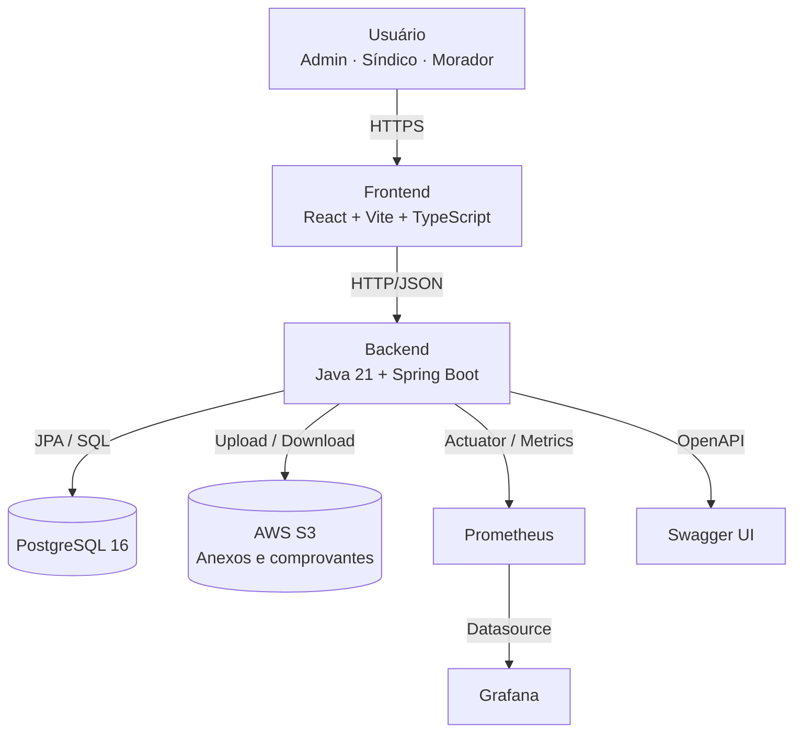
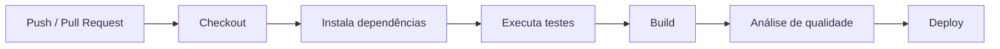
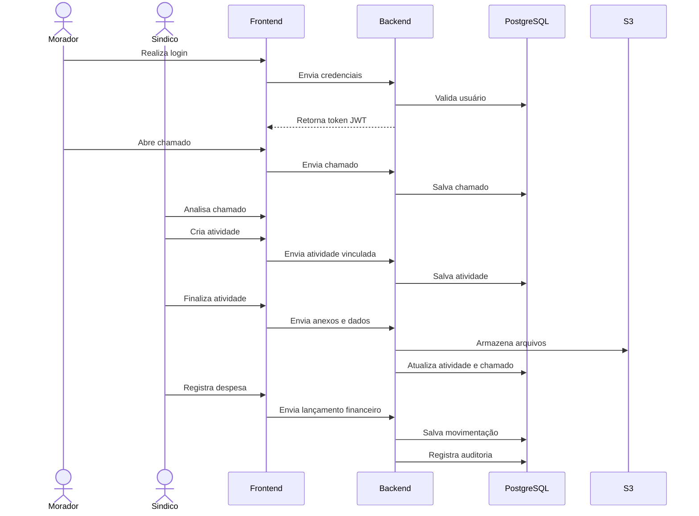

# SindiGo! — Sistema Web de Gestão Condominial

<p align="center">
  
  
  
  
  
  
</p>

<p align="center">
  <a href="https://sonarcloud.io/summary/new_code?id=gtins_sindigo-app">
    
  </a>
  <a href="https://github.com/gtins/sindigo-app/actions">
    
  </a>
  <a href="https://github.com/gtins/frontend-sindigo/actions">
    
  </a>
</p>

---

## Sobre o Projeto

O **SindiGo!** é uma aplicação web desenvolvida para auxiliar síndicos, administradoras e moradores na gestão de condomínios.

O sistema centraliza processos que normalmente ficam espalhados em planilhas, grupos de WhatsApp, e-mails e documentos avulsos, oferecendo uma plataforma única para controle de chamados, atividades, reservas, prestadores de serviço, registros financeiros, anexos e auditoria.

O principal foco do projeto é aumentar a **organização**, a **transparência** e a **rastreabilidade** das rotinas condominiais.

---

## Principais Funcionalidades

* Cadastro e autenticação de usuários;
* Controle de acesso por papéis;
* Cadastro e gerenciamento de condomínios;
* Vínculo de moradores e síndicos aos condomínios;
* Abertura e acompanhamento de chamados;
* Criação e finalização de atividades;
* Cadastro de prestadores de serviço;
* Vínculo de prestadores às atividades;
* Upload de imagens, notas fiscais e comprovantes;
* Reserva de áreas comuns com validação de conflito;
* Aprovação e rejeição de reservas;
* Controle financeiro simplificado;
* Exportação de relatórios em CSV;
* Auditoria de ações importantes;
* Documentação da API com Swagger;
* Monitoramento com Prometheus e Grafana;
* Deploy com Docker e GitHub Actions.

---

## Demonstração do Fluxo Principal

O fluxo principal do sistema funciona da seguinte forma:

1. O usuário realiza login na plataforma;
2. O síndico cadastra ou acessa um condomínio;
3. Moradores são vinculados ao condomínio;
4. Um morador abre um chamado;
5. O síndico analisa o chamado;
6. O síndico cria uma atividade vinculada ao chamado;
7. Um prestador é associado à atividade;
8. A atividade é executada e finalizada com anexos;
9. O chamado é encerrado;
10. A despesa pode ser registrada no financeiro;
11. As ações ficam disponíveis na auditoria.

---

## Tecnologias e Ferramentas

### Back-end

<p>
  
  
  
  
  
  
  
  
</p>

* **Spring Boot:** framework principal da API;
* **Java 21:** linguagem utilizada no backend;
* **Spring Security:** controle de autenticação e autorização;
* **JWT:** autenticação stateless;
* **Spring Data JPA / Hibernate:** persistência dos dados;
* **JUnit e Mockito:** testes unitários;
* **Swagger/OpenAPI:** documentação da API;
* **JaCoCo:** cobertura de testes;
* **SonarCloud:** análise de qualidade do código.

---

### Front-end

<p>
  
  
  
  
  
  
  
  
</p>

* **React:** biblioteca principal da interface;
* **Vite:** ambiente de build e desenvolvimento;
* **TypeScript:** tipagem estática;
* **Axios:** comunicação HTTP com a API;
* **React Router:** gerenciamento de rotas;
* **Vitest:** testes do frontend;
* **Testing Library:** testes de componentes;
* **ESLint:** padronização e qualidade do código.

---

### Infraestrutura e Observabilidade

<p>
  
  
  
  
  
  
  
  
</p>

* **PostgreSQL:** banco de dados relacional;
* **Docker e Docker Compose:** containerização da aplicação;
* **AWS S3:** armazenamento de anexos;
* **Nginx:** proxy reverso e servidor do frontend;
* **Prometheus:** coleta de métricas;
* **Grafana:** visualização de dashboards;
* **GitHub Actions:** CI/CD;
* **SonarCloud:** qualidade do código.

---

## Arquitetura

A aplicação segue uma arquitetura cliente-servidor, separando frontend, backend, banco de dados e serviços auxiliares.



---

## Estrutura dos Repositórios

O projeto é dividido em dois repositórios principais:

| Repositório                                                           | Descrição                                                     |
| --------------------------------------------------------------------- | ------------------------------------------------------------- |
| [`gtins/sindigo-app`](https://github.com/gtins/sindigo-app)           | Backend, banco, Docker Compose, Swagger, Prometheus e Grafana |
| [`gtins/frontend-sindigo`](https://github.com/gtins/frontend-sindigo) | Frontend React, build com Vite e configuração Nginx           |

---

## Back-end

### Estrutura geral

```txt
sindigo-app/
├── .github/
│   └── workflows/
├── monitoring/
│   ├── prometheus/
│   └── grafana/
├── src/
│   ├── main/
│   │   ├── java/
│   │   │   └── com/api/sindigo/
│   │   └── resources/
│   │       └── application.properties
│   └── test/
├── Dockerfile
├── docker-compose.yml
├── mvnw
├── mvnw.cmd
├── pom.xml
└── README.md
```

### Executar localmente

```bash
./mvnw spring-boot:run
```

No Windows:

```bash
mvnw.cmd spring-boot:run
```

### Rodar testes

```bash
./mvnw test
```

### Gerar build

```bash
./mvnw clean package
```

---

## Front-end

### Estrutura geral

```txt
frontend-sindigo/
└── frontend/
    ├── src/
    │   ├── components/
    │   ├── contexts/
    │   ├── hooks/
    │   ├── pages/
    │   ├── routes/
    │   ├── services/
    │   ├── types/
    │   ├── utils/
    │   ├── App.tsx
    │   └── main.tsx
    ├── Dockerfile
    ├── nginx.conf
    ├── package.json
    └── vite.config.ts
```

### Instalar dependências

```bash
cd frontend
npm install
```

### Executar localmente

```bash
npm run dev
```

A aplicação ficará disponível em:

```txt
http://localhost:5173
```

### Rodar testes

```bash
npm run test
```

### Gerar cobertura

```bash
npm run test:coverage
```

### Gerar build

```bash
npm run build
```

---

## Executando com Docker

Na raiz do repositório do backend:

```bash
docker compose up --build
```

Para rodar em segundo plano:

```bash
docker compose up -d --build
```

Para parar os containers:

```bash
docker compose down
```

Para remover também os volumes:

```bash
docker compose down -v
```

> Atenção: o comando `docker compose down -v` remove os dados persistidos no volume do PostgreSQL.

---

## Serviços do Docker Compose

| Serviço    |   Porta | Descrição                  |
| ---------- | ------: | -------------------------- |
| Backend    |  `8080` | API Spring Boot            |
| PostgreSQL | interna | Banco de dados             |
| Prometheus |  `9090` | Coleta de métricas         |
| Grafana    |  `3001` | Dashboard de monitoramento |

---

## Variáveis de Ambiente

Exemplo de `.env` para desenvolvimento:

```env
POSTGRES_DB=sindigo
POSTGRES_USER=postgres
POSTGRES_PASSWORD=postgres

SPRING_DATASOURCE_URL=jdbc:postgresql://postgres:5432/sindigo
SPRING_DATASOURCE_USERNAME=postgres
SPRING_DATASOURCE_PASSWORD=postgres
SPRING_JPA_HIBERNATE_DDL_AUTO=update

APP_CORS_ALLOWED_ORIGINS=http://localhost:5173,http://localhost:8080,https://sindigo.site,https://www.sindigo.site

APP_JWT_SECRET=troque_por_um_segredo_forte
APP_JWT_EXPIRATION=3600000
APP_ADMIN_SECRET_KEY=troque_por_uma_chave_admin

AWS_S3_REGION=us-east-2
AWS_S3_BUCKET_NAME=nome-do-bucket
AWS_ACCESS_KEY_ID=sua_access_key
AWS_SECRET_ACCESS_KEY=sua_secret_key

GRAFANA_ADMIN_USER=admin
GRAFANA_ADMIN_PASSWORD=admin
```

> Nunca versionar arquivos `.env` reais contendo senhas, tokens, chaves AWS ou segredos JWT.

---

## Documentação da API

A documentação da API é disponibilizada via Swagger.

### Local

```txt
http://localhost:8080/swagger-ui.html
```

### OpenAPI JSON

```txt
http://localhost:8080/v3/api-docs
```

---

## Monitoramento

O backend expõe métricas através do Spring Actuator e do Prometheus.

### Endpoints úteis

```txt
GET /actuator/health
GET /actuator/metrics
GET /actuator/prometheus
```

### Acessos locais

```txt
Prometheus: http://localhost:9090
Grafana:    http://localhost:3001
```

---

## Segurança

O sistema aplica práticas de segurança importantes para uma aplicação web:

* Autenticação com JWT;
* Controle de acesso por papéis;
* Proteção de rotas no backend;
* Hash de senhas;
* CORS configurável;
* HTTPS em produção;
* Variáveis de ambiente para dados sensíveis;
* Upload controlado de arquivos;
* Armazenamento de anexos no S3;
* Auditoria de ações relevantes.

---

## Qualidade de Código

O projeto utiliza ferramentas de qualidade e testes automatizados.

### Back-end

* JUnit;
* Mockito;
* JaCoCo;
* SonarCloud.

### Front-end

* Vitest;
* Testing Library;
* ESLint;
* Coverage V8.

---

## CI/CD

O projeto utiliza GitHub Actions para automatizar etapas de build, testes, análise de qualidade e deploy.

### Pipeline geral



---

## Fluxo Completo do Sistema



---

## Roadmap

### Implementado

* Login e autenticação JWT;
* Gestão de usuários;
* Gestão de condomínios;
* Gestão de membros;
* Chamados;
* Atividades;
* Prestadores;
* Reservas;
* Financeiro simplificado;
* Upload de anexos;
* Integração com AWS S3;
* Auditoria;
* Exportação CSV;
* Swagger;
* Prometheus;
* Grafana;
* Docker;
* CI/CD;
* Testes backend;
* Testes frontend.

### Melhorias Futuras

* Recuperação de senha;
* Confirmação de e-mail;
* Notificações automáticas;
* Relatórios financeiros avançados;
* Melhorias na responsividade;
* Aumento da cobertura de testes;
* Melhorias de LGPD;
* Migrações com Flyway ou Liquibase;
* Dashboards mais completos no Grafana.

---

## Autor

**Gustavo Henrique Martins**
Engenharia de Software
Centro Universitário Católica de Santa Catarina

---

## Links Úteis

| Recurso          | Link                                      |
| ---------------- | ----------------------------------------- |
| Backend          | https://github.com/gtins/sindigo-app      |
| Frontend         | https://github.com/gtins/frontend-sindigo |
| Produção         | https://sindigo.site                      |
| Swagger Local    | http://localhost:8080/swagger-ui.html     |
| Prometheus Local | http://localhost:9090                     |
| Grafana Local    | http://localhost:3001                     |

---

## Licença

Este projeto está sob a licença MIT.
